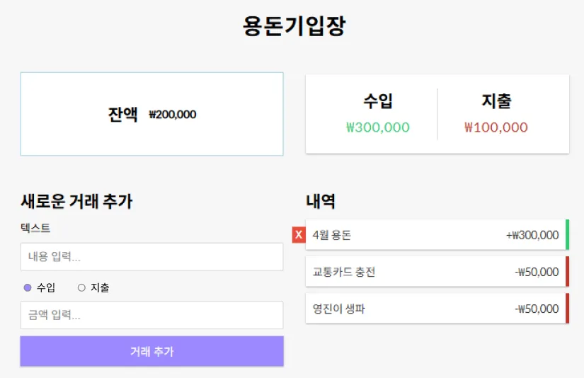

# 용돈기입장



## 개요

사용자가 수입과 지출을 기록하고 잔액을 관리할 수 있는 웹 애플리케이션으로,

모든 데이터는 브라우저의 로컬 스토리지에 저장됩니다.

React의 기본 개념, 상태 관리, 로컬 저장소 활용 능력을 평가하기 위한 것입니다.

디자인의 정확한 구현보다 기능적 요구사항을 충족하는 데 중점

## 기술 스택

- React
- CSS (또는 bootstrap, Tailwind CSS)
- LocalStorage API

## 핵심 기능 요구사항

### 1. 잔액 표시

- 현재 잔액을 상단에 표시
- 수입 금액 합계 표시
- 지출 금액 합계 표시

### 2. 거래 입력 기능

- 텍스트 입력 필드: 거래 내역 설명 입력
- 금액 입력 필드: 거래 금액 입력
- 거래 유형 선택: 수입/지출 구분
- '거래 추가' 버튼: 새 거래를 등록

### 3. 거래 내역 표시

- 각 거래 항목에 대해 다음 정보 표시:
  - 금액 (수입은 녹색 '+', 지출은 빨간색 '-'로 표시)
- 스크롤 가능한 거래 내역 목록
- 거래 삭제 기능 (정말 삭제? 확인 기능 modal)

### 4. 데이터 저장

- 모든 거래 데이터는 LocalStorage에 저장
- 페이지 새로고침 후에도 데이터 유지

## 선택적 추가 기능

- 예쁜 디자인 ^^
- 카테고리 (예: "용돈", "영화", "외식" 기본 카테고리와 카테고리 추가)
- 거래 편집 기능

## 데이터 구조 예시

```jsx
const transactions = [
  {
    id: 1,
    description: "용돈",
    amount: 300000,
    type: "income", // "income" 또는 "expense"
    date: "2025-04-25",
  },
  {
    id: 2,
    description: "영화 관람",
    amount: 11000,
    type: "expense",
    date: "2025-04-25",
  },
];
```

## UI 요구사항

- 제공된 디자인 목업과 일치하지 않아도 됨
- 반응형 디자인 구현 (모바일, 태블릿, 데스크톱)
- 사용자 친화적인 인터페이스

## 개발 가이드라인

1. 컴포넌트 기반 구조 사용 (최소 4개 이상의 컴포넌트로 분리)
2. React Hooks 활용 (useState, useEffect 등)
3. LocalStorage를 위한 커스텀 훅 작성
4. 적절한 에러 처리 구현

## 제출 요구사항

1. 소스 코드 (GitHub 저장소)
2. 실행 가능한 배포 링크
